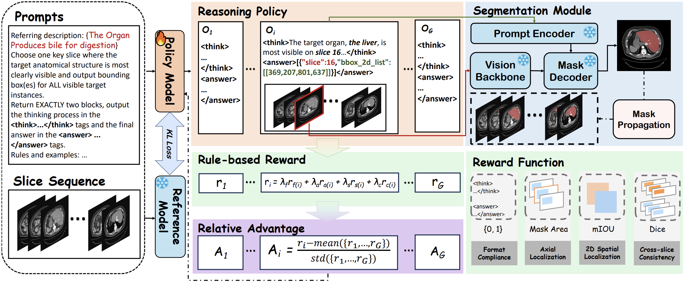
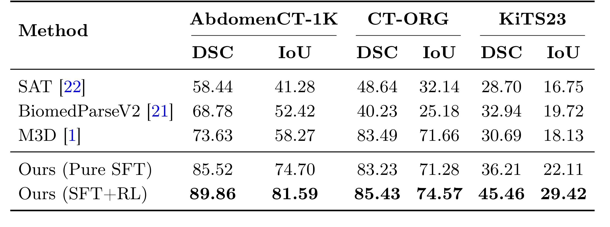
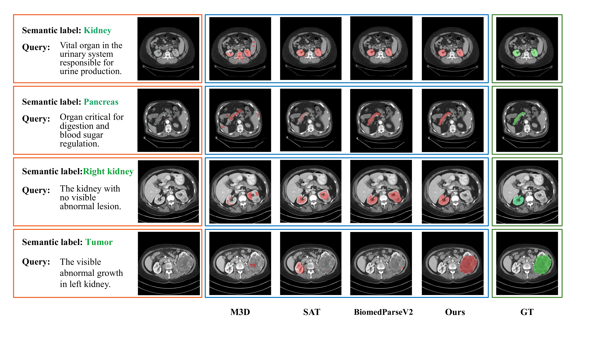

<div align="center">

# MedVol-R1: Reward-Driven Evidence Grounding for Volumetric Reasoning Segmentation

<p>
  <a href="#"></a>
  <a href="#"></a>
  <a href="#"></a>
  <a href="#"></a>
</p>

**Zichun Wang**<sup>1†</sup>, **Hairong Shi**<sup>2†</sup>, Bingzheng Wei<sup>3</sup>, Yan Xu<sup>1✉</sup>, Zihua Wang<sup>4✉</sup>

<sup>1</sup>Beihang University &nbsp; <sup>2</sup>Keio University &nbsp; <sup>3</sup>ByteDance Inc. &nbsp; <sup>4</sup>Tsinghua University

<sup>†</sup>Equal contribution &nbsp;&nbsp; <sup>✉</sup>Corresponding authors

</div>

---

## News

- **[2026-05]** MedVol-R1 is **provisionally accepted at MICCAI 2026 (Top 9%)**.
- **[2026-05]** Project page and code repository are now live.

## Overview

**Volumetric Reasoning Segmentation (VRS)** aims to segment a target region in a 3D medical scan from a *free-form clinical query*, where the referent is often implicit and requires both medical knowledge (e.g., *"the organ that secretes bile"*) and volume-grounded reasoning (e.g., *"the kidney that contains the tumor"*).

Existing LVLM-based methods rely on specialized segmentation tokens (e.g., `<SEG>`) that collapse the decision process into opaque latent representations, limiting interpretability and generalization to diverse narrative expressions.

We present **MedVol-R1**, the *first reinforcement-learning–based framework* for VRS that explicitly **decouples evidence grounding from volumetric delineation**:

- The **LVLM** grounds clinical reasoning to a *verifiable 2D evidence anchor* — a key axial slice plus 2D bounding boxes.
- A **frozen MedSAM2** propagates this anchor into a coherent 3D mask.
- Training combines **cold-start SFT** with **GRPO**, guided by a multi-component reward — without any chain-of-thought annotation.

<p align="center">
  
</p>
<p align="center"><i>Figure 1. Overall pipeline of MedVol-R1. The reasoning policy produces a key-slice and bounding boxes, which are scored by a multi-dimensional rule-based reward and propagated to a 3D mask by a frozen MedSAM2.</i></p>

## Highlights

- **First RL framework for VRS.** We apply GRPO on top of cold-start SFT for volumetric reasoning segmentation, without requiring CoT annotations.
- **Decoupled evidence grounding.** Instead of opaque `<SEG>` tokens, the LVLM outputs a verifiable 2D anchor (key slice + 2D bboxes) that humans can inspect and verify.
- **Multi-component reward.** A composite reward enforces (i) **format compliance**, (ii) **axial evidence selection**, (iii) **2D spatial localization** (Hungarian-matched IoU), and (iv) **cross-slice consistency** (Dice on a local axial neighborhood after MedSAM2 propagation).
- **State-of-the-art on three M3D-Seg CT subsets.** Large gains on the most reasoning-heavy queries (KiTS23: **+14.77 DSC** over M3D).

## Results

### Quantitative Comparison

MedVol-R1 (SFT+RL) achieves the **best DSC and IoU on all three benchmarks**, with the largest improvements on reasoning-heavy queries.

<p align="center">
  
</p>
<p align="center"><i>Table 1. Quantitative comparison with state-of-the-art methods on AbdomenCT-1K, CT-ORG, and KiTS23.</i></p>

**Key takeaways**

- On **AbdomenCT-1K**, MedVol-R1 reaches **89.86 DSC** vs. 73.63 for M3D.
- On **KiTS23** (paraphrased, reasoning-heavy queries), MedVol-R1 reaches **45.46 DSC** vs. 30.69 for M3D.
- GRPO contributes a consistent gain on top of pure SFT: **+4.34 DSC** (AbdomenCT-1K), **+2.20** (CT-ORG), **+9.25** (KiTS23) — the largest gain on the most reasoning-heavy subset.
- Promptable medical parsers (SAT, BiomedParseV2) fail to generalize to free-form narrative queries despite fine-tuning.

### Qualitative Comparison

<p align="center">
  
</p>
<p align="center"><i>Figure 2. Qualitative comparisons on five representative VRS samples. MedVol-R1 yields cleaner boundaries, less leakage into adjacent structures, and more complete target coverage than M3D.</i></p>

## Experimental Setup

- **Base LVLM:** Qwen3-VL-4B
- **Mask Propagator:** frozen MedSAM2
- **Volume representation:** 64 uniformly sampled axial slices at 256×256
- **SFT:** 1 epoch, LoRA rank 128 (all-linear), LR 2×10⁻⁵, per-GPU batch 2
- **GRPO:** 3 epochs, G = 4, β = 0.01, LR 2×10⁻⁶, per-GPU batch 1
- **Optimizer:** AdamW, cosine schedule with 0.1 warmup, bfloat16, gradient checkpointing
- **Hardware:** NVIDIA RTX A6000
- **Max generation length:** 256 tokens

## Datasets

We evaluate on three CT sub-datasets from the **M3D-Seg** benchmark:

- **CT-ORG** — organ-level segmentation.
- **AbdomenCT-1K** — abdominal multi-organ.
- **KiTS23** — kidney and lesion. Test queries are paraphrased to couple lesion attributes with anatomical spatial relations (e.g., *"the kidney containing an obvious fluid-filled sac"*), demanding joint semantic and 3D structural reasoning.

## Citation

If you find this work useful, please cite:

```bibtex
@inproceedings{wang2026medvolr1,
  title     = {MedVol-R1: Reward-Driven Evidence Grounding for Volumetric Reasoning Segmentation},
  author    = {Wang, Zichun and Shi, Hairong and Wei, Bingzheng and Xu, Yan and Wang, Zihua},
  booktitle = {International Conference on Medical Image Computing and Computer-Assisted Intervention (MICCAI)},
  year      = {2026}
}
```

## Acknowledgments

This work is supported by the National Natural Science Foundation of China under Grants 62371016 and U23B2063, the Beijing Natural Science Foundation Haidian District Joint Fund under Grant L222032, the Fundamental Research Funds for the Central University of China from the State Key Laboratory of Software Development Environment in Beihang University, the 111 Project under Grant B13003, SinoUnion Healthcare Inc. under the eHealth program, and HPC resources at Beihang University.

We thank the authors of **M3D**, **MedSAM2**, **SAT**, **BiomedParseV2**, and **DeepSeek-R1 / GRPO** for releasing their work that this project builds upon.

## Contact

For questions, please reach out to the corresponding authors:

- Yan Xu — `xuyan04@gmail.com`
- Zihua Wang — `wangzihua07@126.com`
