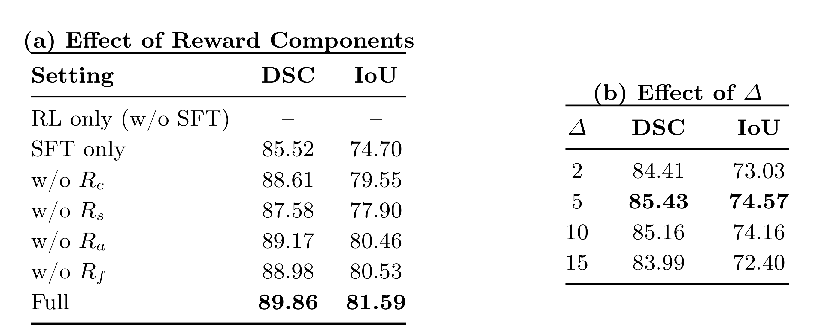

<div align="center">

# MedVol-R1: Reward-Driven Evidence Grounding for Volumetric Reasoning Segmentation

<p>
  <a href="https://arxiv.org/abs/2605.26621"></a>
  <a href="#"></a>
  <a href="#"></a>
  <a href="#"></a>
</p>

<p>
  <a href="https://arxiv.org/abs/2605.26621">Paper</a> ·
  <a href="https://arxiv.org/pdf/2605.26621">PDF</a>
</p>

**Zichun Wang**<sup>1†</sup>, **Hairong Shi**<sup>2†</sup>, Bingzheng Wei<sup>3</sup>, Yan Xu<sup>1✉</sup>, Zihua Wang<sup>4✉</sup>

<sup>1</sup>Beihang University &nbsp; <sup>2</sup>Keio University &nbsp; <sup>3</sup>Bytedance Inc. &nbsp; <sup>4</sup>Tsinghua University

<sup>†</sup>Equal contribution &nbsp;&nbsp; <sup>✉</sup>Corresponding authors

</div>

---

## News

- **[2026-05-26]** MedVol-R1 is available on arXiv.
- **[2026-05]** README figures, tables, and metrics have been synced with the paper version.

## Overview

**Volumetric Reasoning Segmentation (VRS)** aims to segment a target region in a 3D medical scan from a *free-form clinical query*, where the referent is often implicit and requires both medical knowledge and volume-grounded reasoning.

Existing LVLM-based methods often rely on specialized segmentation tokens to connect language with mask decoding, which collapses the decision process into opaque latent representations and limits interpretability.

We present **MedVol-R1**, a reinforcement learning-based framework for VRS that explicitly **decouples evidence grounding from volumetric delineation**:

- The **LVLM** predicts a verifiable **2D evidence anchor**: a key axial slice plus 2D bounding boxes.
- A **frozen MedSAM2** propagates this anchor into a coherent 3D mask.
- Training combines **cold-start SFT** with **GRPO**, guided by a multi-component reward without requiring costly chain-of-thought annotations.

<p align="center">
  
</p>
<p align="center"><i>Figure 1. Overall pipeline of MedVol-R1.</i></p>

## Results

### Quantitative Comparison

MedVol-R1 (**SFT+RL**) achieves the best DSC and IoU on all three benchmarks. Compared with the strongest baseline **M3D**, it improves DSC by **+16.23** on AbdomenCT-1K, **+1.94** on CT-ORG, and **+14.77** on KiTS23.

<p align="center">
  
</p>
<p align="center"><i>Table 1. Quantitative comparison with state-of-the-art methods on AbdomenCT-1K, CT-ORG, and KiTS23.</i></p>

### Qualitative Comparison

The qualitative results below show that MedVol-R1 produces cleaner boundaries, less leakage into adjacent structures, and more complete target coverage than competing baselines.

<p align="center">
  
</p>
<p align="center"><i>Figure 2. Qualitative comparisons on four representative VRS samples across M3D, SAT, BiomedParseV2, MedVol-R1, and GT.</i></p>

### Ablation Study

RL without SFT warm-start fails to converge, confirming the importance of a cold-start policy. Among the reward terms, removing **Rs** causes the largest drop, and the cross-slice consistency window works best at **Δ = 5**.

<p align="center">
  
</p>
<p align="center"><i>Table 2. Ablation studies on reward components and the local axial window size used in the cross-slice consistency reward.</i></p>

## Citation

```bibtex
@article{wang2026medvolr1,
  title   = {MedVol-R1: Reward-Driven Evidence Grounding for Volumetric Reasoning Segmentation},
  author  = {Wang, Zichun and Shi, Hairong and Wei, Bingzheng and Xu, Yan and Wang, Zihua},
  journal = {arXiv preprint arXiv:2605.26621},
  year    = {2026}
}
```

## Acknowledgments

This work was supported by the National Natural Science Foundation of China under Grants 62371016 and U23B2063, the Fundamental Research Funds for the Central Universities from the State Key Laboratory of Software Development Environment at Beihang University, the 111 Project under Grant B13003, and the high-performance computing (HPC) resources at Beihang University.

We thank the authors of **[M3D](https://github.com/BAAI-DCAI/M3D.git)**, **[MedSAM2](https://github.com/bowang-lab/MedSAM2)**, **[SAT](https://github.com/zhaoziheng/SAT)**, and **[BiomedParseV2](https://github.com/microsoft/BiomedParse.git)** for releasing their work.

## Contact

For questions, please reach out to the corresponding authors:

- Yan Xu — `xuyan04@gmail.com`
- Zihua Wang — `wangzihua07@126.com`
